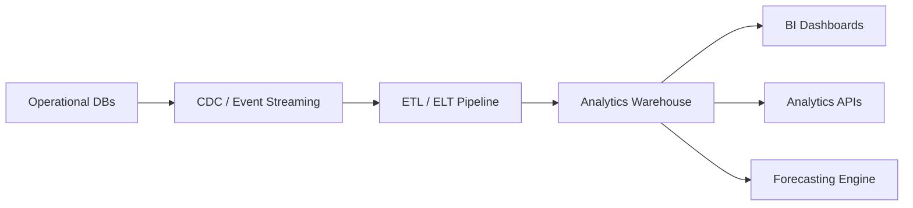
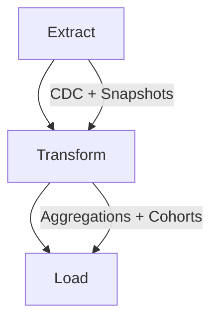

# DokanX Enterprise Data Warehouse & BI System

এই ডকুমেন্টটি DokanX‑এর **Enterprise Data Warehouse & BI System**‑এর ডিজাইন ব্লুপ্রিন্ট। এখানে architecture, data pipeline, warehouse schema, dashboard scope, API contracts, এবং rollout plan দেওয়া হলো।

## 1) Goals

- Operational DB থেকে analytics workload আলাদা করে **fast reporting** চালানো
- **BI dashboards** (merchant + admin)
- **Predictive analytics**‑এর জন্য clean, aggregated datasets
- Scalable, auditable, and secure data pipelines

## 2) Non-Goals (Phase-1)

- Full real‑time ML inference
- 3rd‑party data enrichment (ads, social, etc.)
- Complex ad‑hoc data science notebooks for all teams

## 3) High‑Level Architecture

## 4) Data Sources

Primary sources (Phase-1):
- `orders`
- `products`
- `inventory`
- `wallet_transactions`
- `courier_shipments`
- `pos_sales`
- `search_queries`
- `user_activity`

## 5) ETL / ELT Pipeline

### ETL Jobs (Schedule)
- Hourly: orders, wallet, shipments, inventory deltas
- Daily: `agg_sales_daily`, `agg_top_products`
- Weekly: `agg_sales_weekly`, `agg_retention_cohorts`
- Monthly: `agg_sales_monthly`, merchant LTV, category growth

## 6) Warehouse Schema (Minimum Viable)

### Fact Tables
- `fact_orders` (order_id, merchant_id, customer_id, amount, status, created_at, channel)
- `fact_wallet_tx` (tx_id, merchant_id, amount, type, status, created_at)
- `fact_shipments` (shipment_id, courier_id, status, eta, created_at)
- `fact_pos_sales` (sale_id, merchant_id, amount, created_at)

### Dimension Tables
- `dim_merchants` (merchant_id, category, region, created_at)
- `dim_products` (product_id, merchant_id, category, price)
- `dim_customers` (customer_id, region, joined_at)
- `dim_time` (date_key, day, week, month, quarter, year)
- `dim_geo` (geo_id, city, region, country)

### Aggregate Tables
- `agg_sales_daily` (merchant_id, date, gmv, orders, aov, conversion_rate)
- `agg_sales_weekly` (merchant_id, week, gmv, orders, aov)
- `agg_sales_monthly` (merchant_id, month, gmv, orders, aov)
- `agg_top_products` (merchant_id, product_id, period, sales, quantity)
- `agg_retention_cohorts` (cohort_month, week_1, week_2, week_4)
- `agg_inventory_turnover` (merchant_id, month, turnover_rate)

## 7) BI Dashboards

### Merchant Dashboard
- Total sales, orders, AOV
- Top selling products
- Conversion rate
- Customer repeat rate
- Inventory turnover

### Admin Dashboard
- Platform GMV
- Active merchants
- Active users
- Orders per day
- Revenue growth
- Courier success rate

## 8) Analytics APIs (Phase-1)

Example endpoints:
- `GET /analytics/merchant/sales`
- `GET /analytics/merchant/top-products`
- `GET /analytics/admin/overview`
- `GET /analytics/admin/couriers`
- `GET /analytics/customer/insights`

## 9) Data Governance & Security

- PII tokenization + column‑level encryption
- Access control: merchant data isolation
- Audit logs for ETL jobs
- Data retention policies (operational vs warehouse)

## 10) Forecasting Inputs

Inputs:
- seasonal trends
- sales velocity
- inventory turnover
- category demand

Outputs:
- next month demand forecast
- merchant stock recommendations

## 10.1) Data Model & Metrics Glossary

### Core Entities
- **Order**: Customer purchase record. Source for GMV, AOV, conversion, and retention.
- **Shop/Merchant**: Tenant entity. All warehouse data is scoped by `shopId`.
- **Customer**: Buyer profile. Used for cohorts and repeat rate.
- **Product**: Catalog item. Used for top products and inventory turnover.
- **Shipment**: Courier record. Used for delivery success metrics.
- **Wallet Tx**: Money movement across merchant wallets.

### Fact Tables (Warehouse)
- **fact_orders**: One row per order. Metrics: GMV, order count, channel split.
- **fact_wallet_tx**: One row per wallet transaction. Metrics: inflow/outflow.
- **fact_shipments**: One row per shipment. Metrics: delivery success, SLA.
- **fact_pos_sales**: One row per POS sale. Metrics: offline sales share.

### Dimension Tables (Warehouse)
- **dim_time**: Date calendar mapping for day/week/month/quarter.
- **dim_merchants**: Merchant attributes for segmentation.
- **dim_products**: Product category/price segmentation.
- **dim_customers**: New vs repeat customer analysis.
- **dim_geo**: Region/city breakdown.

### Aggregates & Metrics
- **GMV (Gross Merchandise Value)**: Total order value in a period.
- **Orders**: Count of completed/placed orders (configurable).
- **AOV (Average Order Value)**: `GMV / Orders`.
- **Conversion Rate**: `Orders / Sessions` (requires traffic data).
- **Top Products**: Products ranked by revenue/quantity.
- **Repeat Rate**: `Repeat Customers / Total Customers`.
- **Inventory Turnover**: `Sales / Average Inventory`.
- **Courier Success Rate**: `Delivered / Total Shipments`.

### Snapshot Metric Types (Phase-2)
- **DAILY_SALES**: Array of `{ date, gmv, orders, aov }`.
- **TREND_ANALYTICS**: `{ current: [{ label, value }] }` for charting.
- **MERCHANT_COHORTS**: `{ cohort, merchantCount, activeMerchantCount, retentionRate }`.
- **WALLET_SUMMARY**: `{ credits, debits, net, transactionCount }`.
- **SHIPMENT_STATUS**: `{ total, delivered, failed, successRate, byStatus[] }`.
- **INVENTORY_SNAPSHOT**: `{ totalSkus, totalStock, totalReserved, lowStockCount, outOfStockCount }`.
- **CATEGORY_SPLIT**: `{ category, revenue, quantity }[]`.
- **CHANNEL_SPLIT**: `{ channel, gmv, orders }[]`.
- **TOP_PRODUCTS**: `{ productId, name, revenue, quantity }[]`.
- **CUSTOMER_REPEAT_RATE**: `{ totalCustomers, repeatCustomers, repeatRate }`.
- **CONVERSION_FUNNEL**: `{ stage, count, rate }[]`.

## 11) Rollout Plan (Phase-Based)

**Phase-1: Warehouse + Core ETL**
- CDC ingestion for orders, wallet, shipments
- Build `fact_*` and daily aggregates

**Phase-2: Merchant BI**
- Merchant dashboards + APIs
- Top products, conversion, inventory turnover

**Phase-3: Admin BI**
- Platform GMV, merchant activity, courier performance

**Phase-4: Predictive Analytics**
- Demand forecasting pipeline + model integration

---

## Next Implementation Inputs Needed (Phase-2)

To implement Phase-2 we need:
- Target warehouse tech (e.g., Postgres analytics schema, ClickHouse, BigQuery)
- ETL runner choice (dbt, Airflow, custom worker)
- API service placement (existing analytics service vs new microservice)
